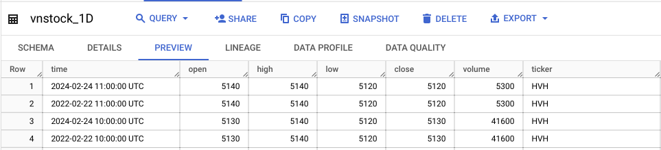

# Building a Comprehensive Data Pipeline for VN-Stock Market Analysis

This project contains process for building a pipeline using `Apache Airflow`. The pipeline extracts data from [vnstock](https://github.com/thinh-vu/vnstock?tab=readme-ov-file) (stock API of TCBS and SSI), transform it, and loads it into a `data warehouse` and `datamart` for business analysis.


## Getting Started

Follow the steps below to setup and run this ETL pipeline.

### Prerequisites and Modules

Before setting up and running this `ETL pipeline`, please ensure you have the following prerequisites in place:

1. **Apache Airflow Installation (version 2.8.1):** Make sure you have `Apache Airflow` correctly installed on your virtual machine. 

2. **Docker(version 24.0.2) and Docker compose (version 2.19.1):** Make sure you have `Docker` and `Docker compose` correctly installed on your virtual machine.

3. **Email:** Configure your email settings to receive error notifications in case of any pipeline failures. 

4. **Google Cloud Services Setup:** Create and configure the necessary `Google Cloud Service` resources as following:

    - **Virtual Machine (VM):** Provision a `virtual machine` instance on `Google Cloud Serice` to serve as your data processing environment.
    - **Google Cloud Storage (GCS):** Set up `Google Cloud Storage` and create the required `buckets` to store your data.
    - **Google BigQuery:** Create and configure a `BigQuery dataset` that will serve as your `data warehouse`.
    - **Cloud Pubsub:** Set up `Cloud Pub/Sub` to record subscribed stock codes and publish them from the Compute Engine.
    - **Cloud Function:** Create `Cloud Functions` to trigger updates to `BigQuery Table` when new data arrives in `Google Cloud Storage` and is published on `Cloud Pub/Sub`.
    - **Data Studio:** Prepare `Data Studio` for displaying charts to monitor subscribed stock codes hourly and data for the last 3 months for analysis. 

5. **Dataproc:** Configure `Dataproc` and set up `Spark` to read data from `Cloud Storage` and perform data processing tasks.

These prerequisites are essential for setting up and running the VN-Stock Market Analysis data pipeline.

### Setup

- Install the dependencies:
```
git clone https://github.com/thinh-vu/vnstock.git
```
- Install Docker, Docker compose:
```
sudo ./installdocker.sh
docker --version
docker compose version
```
- Build airflow: 
```
docker build -t my-airflow .
docker compose up
```
- Go to http://0.0.0.0:8080 to monitor airflow

### Process in the Pipeline

**Main DAGs:**

[Main.py](dags/main.py)


#### Configuration

- **Owner:** Duong.
- **Start Date:** Febuary 26, 2023.
- **Number of Retries:** 3 times.
- **Alert of failure:** Email.
- **Interval between Retries:** 5 minutes.

This pipeline consists of several `DAGs` (Direct Acyclic Graphs) that are scheduled to run at different intevals for data collection, processing, and alerting.

1. **DAG vnstock-pipeline-daily:** [stock_oneday.py](dags/plugin/stock_oneday.py)


- **Scheduler:** Daily at 4pm in working days (Monday to Friday).

- **Tasks:** Daily stock data is collected from `vnstock` and processed at hourly intervals from 9am to 4pm in working days, after which the processed data is sent to `Google Cloud Storage`. Furthermore, `email alerts` are triggered to notify successful execution of these tasks.

- **Bigquery:** received and presented data.

- **Data Format:** `['time','open','high','low','close','volume','ticker']`.



**This command:** `stock_data=stock_historical_data (symbol=stock, start_date=current_date, end_date=current_date, resolution="1H", type='stock')`
    
2. **Stock_pipeline-yearly:** [stock_oneyear.py](dags/plugin/stock_oneyear.py)


- **Scheduler:** Weekly at 4pm every Friday.

- **Task:** The system gathers a year's worth of data and stores in `Google Cloud Storage`. Use `pySpark` and `Dataproc` to process data from `Google Cloud Storage`, then compute the most consistency growing stock codes over the lastest quarter, where stability is defined by an average index increase within a 10% amplitude range and the least volume is 1000 stocks everydays. The results are then sent to `Bigquery` for advanced analysis.

**Bigquery:** received and presented data.

- **Data Format:** `['time', 'Ticker','close','min_Volume']`.


**This command:** `stock_data=stock_historical_data (symbol=stock, start_date=start_date, end_date=current_date, resolution='1D', type='stock')` with `start_date` is 360 days before current date.

3. **vnstock-pipeline-1H:** [stock_subscription.py](dags/plugin/stock_subscribe.py)


- **Scheduler:** Hourly between 9AM - 15PM.

- **Task:** Users is possible to select their preferred [stock_code.txt](dags/file/stock_code.txt) for monitoring. This module continually updates the stock indices every hour during trading hours and publishes them to `Cloud Pub/Sub`. Upon new data being published on `Cloud Pub/Sub`, it triggers the system to read and incorporate the fresh information into `Bigquery` for seamless integration of real-time data updates.

**Cloud function log:** check and trigger when `Cloud pubsub` received sucessfully data from vm.


**Bigquery:** received and presented data.

- **Data Format:** `['time', 'open','high','low','close','volume','ticker]`.


**This command:** `data_lastest = stock_intraday_data(symbol=stock, page_size=1, investor_segment=False)`.

4. **Visualization:**

- **Scheduler:** Hourly.

- **Task:** In Data Studio, set up line charts that display real-time hourly updates for the stock codes you've subscribed to. Additionally, create line charts that visualize the stable-growing stock codes over a three-month period for insightful analysis.


5. **Reference:**
[1] [How To Install and Use Docker on Ubuntu 20.04](https://www.digitalocean.com/community/tutorials/how-to-install-and-use-docker-on-ubuntu-20-04).
[2] [Pyspark through Dataproc GCP using Airflow](https://ilhamaulanap.medium.com/data-lake-with-pyspark-through-dataproc-gcp-using-airflow-d3d6517f8168).
[3] [Install Airflow on Docker](https://www.youtube.com/watch?v=aTaytcxy2Ck&t=318s).
[4] [Airflow apache setup](https://github.com/apache/airflow).
[5] [Sending Emails using Airflow EmailOperator](https://hevodata.com/learn/airflow-emailoperator/).
[6] [Virtual machine instances guide](https://cloud.google.com/compute/docs/instances).
[7] [Cloud Storage documentation](https://cloud.google.com/storage/docs).
[8] [BigQuery documentation](https://cloud.google.com/bigquery/docs).
[9] [Cloud Pub/Sub documentation](https://cloud.google.com/pubsub/docs).
[10] [Cloud Functions documentation](https://cloud.google.com/functions/docs).
[11] [Looker Studio](https://developers.google.com/looker-studio).
[12] [Dataproc documentation](https://spark.apache.org/docs/latest/sql-getting-started.html).


